# Modelo de Dados - Baby Book

Nota: O modelo de dados foi atualizado para refletir as decisões do [BABY BOOK: DOSSIÊ DE EXECUÇÃO](Dossie_Execucao.md). Use o dossiê como fonte canônica ao propor alterações de schema que afetem custos, contratos ou políticas fiscais.

## Sumário

- [Princípios e Escopo](#princípios-e-escopo)
- [Visão ER (Alto Nível) e Centros de Gravidade](#visão-er-alto-nível-e-centros-de-gravidade)
- [Papéis e Escopos de Acesso (RBAC) - Implicações](#papéis-e-escopos-de-acesso-rbac---implicações)
- [DDL — Core (Tipos, Contas, Domínio)](#ddl--core-tipos-contas-domínio)
  - [4.1. Conta, Usuários e RBAC](#41-conta-usuários-e-rbac)
  - [4.2. Políticas, Entitlements e Monetização](#42-políticas-entitlements-e-monetização)
  - [4.3. Domínio Principal (Crianças, Pessoas, Relações)](#43-domínio-principal-crianças-pessoas-relações)
  - [4.4. Momentos, Templates e Capítulos (O Coração da UI)](#44-momentos-templates-e-capítulos-o-coração-da-ui)
- [DDL — Mídia, Uploads e PoD (Assets)](#ddl--mídia-uploads-e-pod-assets)
- [DDL — Features (Séries, Compart., Saúde, etc.)](#ddl--features-séries-compart-saúde-etc)
  - [6.1. Séries (Recorrências)](#61-séries-recorrências)
  - [6.2. Compartilhamento e Guestbook](#62-compartilhamento-e-guestbook)
  - [6.3. Export e PoD (Print-on-Demand)](#63-export-e-pod-print-on-demand)
  - [6.4. Cápsula, Saúde e Cofre (Dados Sensíveis)](#64-cápsula-saúde-e-cofre-dados-sensíveis)
- [DDL — Operação (Auditoria e Uso Assíncrono)](#ddl--operação-auditoria-e-uso-assíncrono)
  - [7.1. Contagem de Uso Assíncrona (A Solução para Hotspots)](#71-contagem-de-uso-assíncrona-a-solução-para-hotspots)
  - [7.2. Auditoria e Idempotência](#72-auditoria-e-idempotência)
- [RLS (Row Level Security) e Políticas](#rls-row-level-security-e-políticas)
  - [8.1. O Contrato com o Middleware (GUCs)](#81-o-contrato-com-o-middleware-gucs)
  - [8.2. Políticas de Base (Default Deny)](#82-políticas-de-base-default-deny)
  - [8.3. Políticas Específicas (A Lógica de Negócio no DB)](#83-políticas-específicas-a-lógica-de-negócio-no-db)
- [Lógica de Banco (Views, Funções e Triggers)](#lógica-de-banco-views-funções-e-triggers)
  - [9.1. Views (Leitura Otimizada)](#91-views-leitura-otimizada)
  - [9.2. Funções (Helpers e Triggers)](#92-funções-helpers-e-triggers)
  - [9.3. Triggers (Eventos de Banco)](#93-triggers-eventos-de-banco)
- [Processos Operacionais (Jobs)](#processos-operacionais-jobs)
  - [10.1. Job 1: Agregação de Contadores de Uso (Obrigatório)](#101-job-1-agregação-de-contadores-de-uso-obrigatório)
  - [10.2. Job 2: Geração de Ocorrências de Séries (Obrigatório)](#102-job-2-geração-de-ocorrências-de-séries-obrigatório)
  - [10.3. Job 3: Abertura de Cápsulas (Obrigatório)](#103-job-3-abertura-de-cápsulas-obrigatório)
  - [10.4. Job 4: Coleta de Lixo (Garbage Collection) de Assets Órfãos (Obrigatório)](#104-job-4-coleta-de-lixo-garbage-collection-de-assets-órfãos-obrigatório)
  - [10.5. Job 5: Reconciliação dos Flags RLS de Assets (Opcional, mas recomendado)](#105-job-5-reconciliação-dos-flags-rls-de-assets-opcional-mas-recomendado)
- [Anexos (Índices, API, Migração, LGPD, Testes)](#anexos-índices-api-migração-lgpd-testes)

## Princípios e Escopo

Esta seção define as restrições e decisões fundamentais que governam todo o modelo de dados, alinhadas com o documento Arquitetura & Domínio.

Fonte de Verdade: PostgreSQL (metadados) + Storage híbrido (Cloudflare R2 hot + Backblaze B2 cold) para mídia. Justificativa: Esta separação é crucial e é o pilar do nosso modelo de Visão & Viabilidade. O PostgreSQL (via Neon) armazena metadados (texto, JSON, UUIDs), que têm um custo de armazenamento low-cost e previsível. O storage híbrido mantém thumbnails/previews na borda (R2) e os originais no cold storage (B2), otimizando custo e egress. Tentar armazenar mídia no banco (ex: bytea) seria financeiramente proibitivo e tecnicamente ineficiente, quebrando o "God SLO" de Custo de Estoque (< R$ 2,00/ano).
Multi-tenant: Por account_id com RLS (Row Level Security) ativo em todo o domínio.Implicação: A API (FastAPI) nunca deve escrever uma query com WHERE account_id = ?. Este é um anti-pattern perigoso. O RLS (Seção 8) injeta essa condição automaticamente no nível do banco. Isso é a nossa principal defesa contra vazamento de dados entre contas (tenants). Um bug na API (que "esqueça" o WHERE) é contido pelo banco, que não retornará linhas que não pertençam ao app.account_id setado na sessão (ver 8.1).
Concorrência: Otimista. rev + updated_at $\rightarrow$ ETag W/"<rev>-<epoch>" com If-Match.Justificativa: Em uma aplicação web colaborativa (pai e mãe editando), locks pessimistas (SELECT...FOR UPDATE) são um gargalo de performance que serializa o acesso. É preferível permitir a colisão (duas pessoas salvarem ao mesmo tempo) e rejeitar a segunda escrita com um erro 412 Precondition Failed.
Implicação (UI): A UI (cliente), conforme a Estrutura do Projeto (Seção 3.9), deve tratar o 412 de forma inteligente: ela deve informar ao usuário ("Alguém salvou este momento enquanto você editava. Suas alterações não foram salvas.") e, idealmente, oferecer um "diff" ou a opção de "copiar minhas alterações" antes de recarregar os dados do servidor. A trigger touch_rev (Seção 9.3) implementa a mecânica de ETag no DDL.
Observabilidade e Integração: audit_event (trilha para humanos) e Cloudflare Queues (integração para máquinas).Implicação: Este DDL não contém um "Transactional Outbox" (app.outbox_event). Esta é uma decisão de arquitetura deliberada, alinhada com a Visão & Viabilidade (Seção 2.2.3) e a Estrutura do Projeto (Seção 2.1). O padrão Outbox (uma tabela de jobs no Postgres) introduz complexidade de polling (um worker teria que "sondar" o banco em SELECT ... FOR UPDATE SKIP LOCKED), o que gera custos de I/O desnecessários no Neon (mantendo o compute ativo). Ao mover essa lógica para a Cloudflare Queues, nós:Simplificamos o DDL (menos uma tabela crítica).
Ganhamos retries, backoff exponencial e DLQ (Dead-Letter Queue) "de graça", gerenciados pela infraestrutura de borda (conforme Estrutura do Projeto 15.3).
Mantemos apenas o Job de agregação de uso (Seção 7.1), pois este precisa de consistência transacional com o DDL (é um UPDATE em lote, não um job de processamento).
Uso e Quotas: Contagem assíncrona (Seção 7 e 10) para evitar contenção. v_effective_quotas (Seção 9) consolida o uso base (Plano Base: 2GiB/60 momentos / 5 repetições) + entitlements de repetição (Seção 4.2).Justificativa: Esta é a implementação do nosso modelo de negócio (PCE + Upsell de Repetição). O DDL distingue dois tipos de limite que a API deve tratar de formas diferentes:Quotas Físicas: (ex: 2 GiB). São um hard-stop de segurança para evitar abuso de custo e proteger nossa Provisão de Custo de Estoque (PCE). A API deve retornar 413 Payload Too Large (conforme Estrutura do Projeto 4.4, quota.bytes.exceeded).
Quotas de Repetição: (ex: 5 entradas de 'Visita Especial'). São um soft-stop de negócio, projetado para acionar o upsell. A API usa a v_effective_quotas para validar este limite e retornar o erro 402 quota.recurrent_limit.exceeded (conforme Estrutura do Projeto 4.4).
RBAC: Owner, Guardian (guardião) e Viewer. Saúde/Cofre $\rightarrow$ Somente Owner.Justificativa: O Guardian (ex: avós) pode ter acesso a memórias privadas (privacy = 'private'), mas nunca a dados sensíveis (Cofre/Saúde). O Viewer (ex: amigos da família) só vê o que é explicitamente público (status = 'published'). Isso reflete a IA dos "3 Livros" do Catálogo de Momentos.
Timezone: UTC no banco; conversões na borda (API/UI).Implicação: Todos os campos timestamp no DDL são armazenados em UTC (timestamptz). A API (FastAPI) e a UI (React) são responsáveis por converter esse UTC para o fuso horário local do usuário ou da criança (ex: America/Sao_Paulo) antes de exibir. Isso é crítico para moment.occurred_at e series.rrule (recorrências), garantindo que um "Mêsversário" (Job 2, Seção 10.2) seja gerado no dia correto, independentemente do fuso horário do servidor.

## Visão ER (Alto Nível) e Centros de Gravidade

O modelo de dados gira em torno de três "centros de gravidade". O ER reflete a Arquitetura de Informação do Catálogo de Momentos:

ACCOUNT: O "contêiner" de faturamento, tenancy e entitlements (permissões de upsell).
MOMENT: O coração do produto. É o "post" ou "página do álbum". É o centro do "Livro de Memórias (Jornada)".
ASSET: O "arquivo físico". É a entidade que rastreia a mídia desde o upload até a transcodificação e seu uso em quotas.
HEALTH / VAULT: Entidades de alta segurança (somente Owner) que representam o "Livro de Saúde".
GUESTBOOK / SHARE_LINK: Entidades de engajamento que representam o "Livro de Visitas".

```mermaid
erDiagram
    ACCOUNT ||--o{ ACCOUNT_USER : "M2M via"
    APP_USER ||--o{ ACCOUNT_USER : "M2M via"
    ACCOUNT ||--o{ APP_POLICY : "config (1:1)"
    ACCOUNT ||--o{ GUARDIAN_INVITE : invites

    ACCOUNT ||--o{ CHILD : owns
    ACCOUNT ||--o{ PERSON : owns
    ACCOUNT ||--o{ RELATION_TYPE : defines
    PERSON_RELATION }o--|| CHILD : relates
    PERSON_RELATION }o--|| PERSON : relates
    PERSON_RELATION }o--|| RELATION_TYPE : as

    ACCOUNT ||--o{ MOMENT_TEMPLATE : "defines (schema)"
    ACCOUNT ||--o{ MOMENT : owns
    MOMENT ||--o{ MOMENT_PERSON : tags

    ACCOUNT ||--o{ ASSET : owns
    ASSET ||--o{ ASSET_VARIANT : derives
    ASSET ||--o{ ASSET_EXIF : "metadata (PoD)"
    MOMENT ||--o{ MOMENT_ASSET : slots

    MOMENT ||--o{ SHARE_LINK : shares
    CHILD ||--o{ GUESTBOOK_ENTRY : receives
    ACCOUNT ||--o{ CAPSULE : owns
    CAPSULE ||--o{ CAPSULE_ITEM : items
    ACCOUNT ||--o{ HEALTH_MEASUREMENT : tracks
    ACCOUNT ||--o{ HEALTH_VISIT : tracks
    ACCOUNT ||--o{ VAULT_DOCUMENT : vaults
    ACCOUNT ||--o{ EXPORT_JOB : exports

    ACCOUNT ||--o{ PRINT_JOB : "PoD"
    PRINT_JOB ||--o{ PRINT_JOB_ITEM : "PoD items"
    MOMENT ||--o{ PRINT_JOB_ITEM : "in PoD"

    ACCOUNT ||--o{ AUDIT_EVENT : audits
    ACCOUNT ||--o{ USAGE_COUNTER : "usage (1:1)"
    ACCOUNT ||--o{ USAGE_EVENT_QUEUE : queues
```



## Papéis e Escopos de Acesso (RBAC) - Implicações

Reflete Arquitetura & Domínio (Apêndice A) e Catálogo de Momentos (Seção 1, 2, 3).

Owner:Definição: O administrador da conta. Geralmente quem paga. O modelo account_user permite múltiplos Owners (ex: pai e mãe).
Implicações (API): O GUC (Seção 8.1) app.user_role é setado como 'owner'. Tem acesso de escrita (p_moment_write) e acesso de leitura a tabelas sensíveis (p_health_all).
Implicações (UI): Vê todas as abas (Jornada, Saúde, Visitas). Vê botões de "Editar", "Apagar", "Moderar" (no Guestbook) e "Ver Faturamento". É o único que vê a aba "Saúde" (Cofre/Curvas).
Guardian:Definição: Membro da família confiável (ex: avós, tios).
Implicações (API): O GUC app.user_role é setado como 'guardian'. Tem acesso de leitura a momentos privados (p_moment_select) mas é bloqueado (p_health_all) da aba "Saúde" no nível do banco.
Implicações (UI): Vê as abas "Jornada" e "Visitas". Não vê a aba "Saúde". Pode ver momentos com privacy = 'private' ou 'people'. Pode postar no Guestbook (p_guestbook_insert), mas não pode moderar (p_guestbook_update falha).
Viewer:Definição: Convidado com acesso limitado (ex: amigos da família).
Implicações (API): O GUC app.user_role é setado como 'viewer'. É o papel mais restrito. A RLS p_moment_select filtra momentos, retornando apenas aqueles com status='published'.
Implicações (UI): Vê as abas "Jornada" e "Visitas". Não vê a aba "Saúde". Na "Jornada", vê apenas momentos publicados. Vê apenas entradas visible no Guestbook.
Anônimo (link):Definição: Um usuário não autenticado acessando via share.babybook.com/....
Implicações (API): Não há GUCs setados. O acesso não é feito pela API principal, mas pelo apps/edge (SSR), que usa a tabela app.share_link para buscar e renderizar um único momento/capítulo.

## DDL — Core (Tipos, Contas, Domínio)

```sql
CREATE EXTENSION IF NOT EXISTS citext;      -- e-mail case-insensitive
CREATE EXTENSION IF NOT EXISTS pgcrypto;    -- gen_random_uuid()
CREATE EXTENSION IF NOT EXISTS btree_gin;   -- GIN em tipos ordenáveis
CREATE SCHEMA IF NOT EXISTS app;

-- Tipos de domínio (ENUMs)
-- Estes tipos forçam a consistência dos dados no nível do banco.
CREATE TYPE app.moment_status  AS ENUM ('draft','processing','ready','published');
CREATE TYPE app.privacy_level  AS ENUM ('private','people','link');
CREATE TYPE app.viewer_type    AS ENUM ('list','grid','calendar','timeline','series','dashboard','people','reading','map');
CREATE TYPE app.asset_kind     AS ENUM ('photo','video','audio');
CREATE TYPE app.asset_status   AS ENUM ('queued','processing','ready','failed');
CREATE TYPE app.guest_state    AS ENUM ('pending','visible','deleted');
CREATE TYPE app.user_role      AS ENUM ('owner','guardian','viewer');
CREATE TYPE app.asset_slot     AS ENUM ('photo','video','audio');
CREATE TYPE app.order_status   AS ENUM ('pending','paid','canceled','failed');
CREATE TYPE app.vault_kind     AS ENUM ('certidao','cpf_rg','sus_plano','outro'); -- (Ref: Catálogo B.4)
```

### 4.1 Conta, Usuários e RBAC

```sql
CREATE TABLE IF NOT EXISTS app.account (
  id uuid PRIMARY KEY DEFAULT gen_random_uuid(),
  name text NOT NULL,
  plan text NOT NULL DEFAULT 'plano_base', -- Define o plano base (Acesso Perpétuo)

  -- ALINHADO COM VIABILIDADE (Seção 3.1): Flags de Upsell (Pacotes de Repetição)
  -- Estes flags são a implementação do "entitlement" (permissão).
  -- A API (no webhook de pagamento) seta um destes flags para `true`.
  -- A view `v_effective_quotas` (Seção 9.1) lê estes flags para conceder
  -- o acesso (ex: 999999 repetições) para a categoria de upsell correspondente.
  unlimited_social boolean NOT NULL DEFAULT false,     -- Upsell para 'Visitas' e 'Guestbook'
  unlimited_creative boolean NOT NULL DEFAULT false,   -- Upsell para 'Arte' e 'Manias'
  unlimited_tracking boolean NOT NULL DEFAULT false,   -- Upsell para 'Saúde', 'Barriga'

  created_at timestamptz NOT NULL DEFAULT now()
);

-- Esta é a tabela de "autenticação" (usuários globais)
CREATE TABLE IF NOT EXISTS app.app_user (
  id uuid PRIMARY KEY DEFAULT gen_random_uuid(),
  email citext UNIQUE NOT NULL, -- (citext: case-insensitive)
  name text NOT NULL,
  locale text NOT NULL DEFAULT 'pt-BR',
  password_hash text NOT NULL,
  created_at timestamptz NOT NULL DEFAULT now(),
  updated_at timestamptz NOT NULL DEFAULT now(),
  rev int NOT NULL DEFAULT 1
);

-- Esta é a tabela de "autorização" (junção M2M)
-- Justificativa: Separa *quem* você é (app_user) de *o que* você pode fazer (account_user.role)
-- e *onde* (account_user.account_id). Permite que uma avó (app_user) seja 'guardian'
-- na conta do neto A e 'viewer' na conta do sobrinho B.
CREATE TABLE IF NOT EXISTS app.account_user (
  account_id uuid NOT NULL REFERENCES app.account(id) ON DELETE CASCADE,
  user_id uuid NOT NULL REFERENCES app.app_user(id) ON DELETE CASCADE,
  role app.user_role NOT NULL DEFAULT 'owner',
  created_at timestamptz NOT NULL DEFAULT now(),
  PRIMARY KEY (account_id, user_id)
);

CREATE TABLE IF NOT EXISTS app.guardian_invite (
  id uuid PRIMARY KEY DEFAULT gen_random_uuid(),
  account_id uuid NOT NULL REFERENCES app.account(id) ON DELETE CASCADE,
  email citext NOT NULL,
  role app.user_role NOT NULL CHECK (role IN ('guardian','viewer')),
  token text NOT NULL UNIQUE, -- Token opaco enviado por e-mail
  expires_at timestamptz NOT NULL,
  accepted_at timestamptz NULL,
  created_at timestamptz NOT NULL DEFAULT now()
);
```

### 4.2 Políticas, Entitlements e Monetização

```sql
-- Políticas de fallback e limites por conta.
-- Justificativa: Define as regras de negócio e os *limites gratuitos*
-- que servem de gatilho para o upsell (lido pela API e pela View 9.1).
-- Rationale: Manter isso no DDL (vs. hardcoded na API) nos permite,
-- no futuro, rodar A/B testes (ex: 7 repetições grátis para 10% dos usuários)
-- ou alterar o limite (de 5 para 10) sem um novo deploy de código.
CREATE TABLE IF NOT EXISTS app.app_policy (
  account_id uuid PRIMARY KEY REFERENCES app.account(id) ON DELETE CASCADE,

  -- Limites de Mídia (Padrões de Template)
  photos_per_moment int NOT NULL DEFAULT 3,
  audios_per_moment int NOT NULL DEFAULT 1,
  video_max_sec int NOT NULL DEFAULT 10,

  -- Limites de Upsell (alinhado com Visão & Viabilidade, Seção 3.1)
  -- Este é o "N" gratuito. A `v_effective_quotas` (9.1) compara
  -- o uso do usuário com este limite *se* o flag de upsell (4.1) for `false`.
  recurrent_moment_limit int NOT NULL DEFAULT 5, -- O gatilho (ex: 5 entradas grátis)

  -- Outras regras
  guestbook_default_limit int NOT NULL DEFAULT 50,
  guestbook_allow_media boolean NOT NULL DEFAULT false,

  created_at timestamptz NOT NULL DEFAULT now(),
  updated_at timestamptz NOT NULL DEFAULT now(),
  rev int NOT NULL DEFAULT 1
);

-- A tabela `app.entitlement` foi REMOVIDA.
-- O modelo de upsell mudou de "soma de cotas" (ex: +1GiB) para
-- "flags booleanos" (ex: unlimited_social: true), que agora
-- vivem diretamente na tabela `app.account` (Seção 4.1).

-- (Tabelas de monetização: product, price, order, order_item omitidas por brevidade)
```

### 4.3 Domínio Principal (Crianças, Pessoas, Relações)

```sql
CREATE TABLE IF NOT EXISTS app.child (
  id uuid PRIMARY KEY DEFAULT gen_random_uuid(),
  account_id uuid NOT NULL REFERENCES app.account(id) ON DELETE CASCADE,
  name text NOT NULL CHECK (char_length(name) BETWEEN 1 AND 120),
  birthday date NULL,
  avatar_url text NULL,
  created_at timestamptz NOT NULL DEFAULT now(),
  updated_at timestamptz NOT NULL DEFAULT now(),
  rev int NOT NULL DEFAULT 1,
  deleted_at timestamptz NULL
);

CREATE TABLE IF NOT EXISTS app.person (
  id uuid PRIMARY KEY DEFAULT gen_random_uuid(),
  account_id uuid NOT NULL REFERENCES app.account(id) ON DELETE CASCADE,
  name text NOT NULL CHECK (char_length(name) BETWEEN 1 AND 120),
  avatar_url text NULL,
  created_at timestamptz NOT NULL DEFAULT now(),
  updated_at timestamptz NOT NULL DEFAULT now(),
  rev int NOT NULL DEFAULT 1,
  deleted_at timestamptz NULL
);

-- Suporta "Árvore da Família" (Catálogo B.2) de forma flexível
-- Justificativa: `is_global=true` marca os tipos padrão ("Pai", "Mãe").
-- `is_global=false` permite que um Owner crie um tipo customizado (ex: "Dinda").
CREATE TABLE IF NOT EXISTS app.relation_type (
  id uuid PRIMARY KEY DEFAULT gen_random_uuid(),
  account_id uuid NOT NULL REFERENCES app.account(id) ON DELETE CASCADE,
  key text NOT NULL, -- 'mae', 'pai', 'avo_materno', 'madrinha'
  display_name text NOT NULL,
  is_global boolean NOT NULL DEFAULT false, -- Se true, é um seed do sistema
  created_at timestamptz NOT NULL DEFAULT now(),
  UNIQUE(account_id, key)
);

CREATE TABLE IF NOT EXISTS app.person_relation (
  child_id uuid NOT NULL REFERENCES app.child(id) ON DELETE CASCADE,
  person_id uuid NOT NULL REFERENCES app.person(id) ON DELETE CASCADE,
  kind_id uuid NOT NULL REFERENCES app.relation_type(id) ON DELETE RESTRICT,
  PRIMARY KEY (child_id, person_id, kind_id)
);
```

### 4.4 Momentos, Templates e Capítulos (O Coração da UI)

```sql
-- Esta tabela é o "Catálogo". Ela define a *estrutura* de um momento.
-- A UI (React) deve buscar esta tabela primeiro para saber o que renderizar.
CREATE TABLE IF NOT EXISTS app.moment_template (
  id uuid PRIMARY KEY DEFAULT gen_random_uuid(),
  account_id uuid NOT NULL REFERENCES app.account(id) ON DELETE CASCADE,
  key text NOT NULL,           -- ex.: 'primeiro_sorriso', 'mesversario', 'visita_especial'

  -- ALINHADO: Categoria de Upsell (lida pela API para retornar o erro 402 correto)
  -- Este é o *link* crítico entre o DDL e o Faturamento.
  -- Rationale: Quando a API vai criar um momento (ex: 'visita_especial') e
  -- vê que o limite de 5 foi atingido, ela lê este campo ('social').
  -- Ela então retorna o erro 402 com o payload `{ package: 'social' }`.
  -- A UI (conforme `Estrutura do Projeto` 8.5) intercepta esse erro
  -- e abre o modal de upsell correto (o Pacote Social).
  upsell_category text NULL CHECK (upsell_category IN ('social', 'creative', 'tracking')),

  display_name text NOT NULL,  -- Rótulo (ex: "Primeiro Sorriso")
  limits jsonb NOT NULL,       -- Limites de mídia (ex: {"photo":3,"video":1})
  rules jsonb NULL,            -- Regras (ex: {"xor_groups":[["video","audio"]]})
  order_index int NULL,        -- (Ref: Catálogo de Momentos) Ordem de exibição na UI
  version int NOT NULL DEFAULT 1,

  -- A UI lê este campo para exibir a "Prompt/Dica (Microcopy)"
  prompt_microcopy jsonb NULL, -- {"pt": "O momento que tudo mudou!...", "es": "..."}

  -- O campo de *validação* (API/backend).
  -- Define as regras (ex: "peso_kg" é um "number" > 0).
  data_schema jsonb NULL,      -- JSON Schema (define os "Campos (Engenharia)" da UI)

  -- O campo de *apresentação* (UI/frontend).
  -- Define *como* renderizar (ex: "peso_kg" é um "TextInput" com label "Peso (kg)").
  ui_schema jsonb NULL,        -- (Ex: react-jsonschema-form 'uiSchema')
  UNIQUE(account_id, key, version)
);

-- Esta tabela é a "Instância". Ela armazena os *dados* que o usuário preencheu.
CREATE TABLE IF NOT EXISTS app.moment (
  id uuid PRIMARY KEY DEFAULT gen_random_uuid(),
  account_id uuid NOT NULL REFERENCES app.account(id) ON DELETE CASCADE,
  child_id uuid NULL REFERENCES app.child(id) ON DELETE SET NULL,
  template_id uuid NULL REFERENCES app.moment_template(id) ON DELETE SET NULL,
  series_id uuid NULL, -- FK adicionada na Seção 6
  series_index int NULL,
  occurred_at timestamptz NOT NULL, -- A data em que o evento ocorreu
  status app.moment_status NOT NULL DEFAULT 'draft',
  privacy app.privacy_level NOT NULL DEFAULT 'private',
  location jsonb NULL,

  -- Armazena os dados que validam contra o 'moment_template.data_schema'.
  -- Ex: {"peso_kg": 5.1, "reacao": "fez_careta", "onde_foi": "Na casa da vovó"}
  data jsonb NULL,

  tags text[] NOT NULL DEFAULT '{}',
  created_at timestamptz NOT NULL DEFAULT now(),
  updated_at timestamptz NOT NULL DEFAULT now(),
  rev int NOT NULL DEFAULT 1,
  deleted_at timestamptz NULL
);

CREATE TABLE IF NOT EXISTS app.moment_person (
  moment_id uuid NOT NULL REFERENCES app.moment(id) ON DELETE CASCADE,
  person_id uuid NOT NULL REFERENCES app.person(id) ON DELETE CASCADE,
  PRIMARY KEY (moment_id, person_id)
);

-- (Tabelas marker_type, marker, chapter, chapter_moment omitidas por brevidade)
```

## DDL — Mídia, Uploads e PoD (Assets)

```sql
CREATE TABLE IF NOT EXISTS app.asset (
  id uuid PRIMARY KEY DEFAULT gen_random_uuid(),
  account_id uuid NOT NULL REFERENCES app.account(id) ON DELETE CASCADE,
  kind app.asset_kind NOT NULL,
  status app.asset_status NOT NULL DEFAULT 'queued',
  key_original text NULL, -- O path no S3/B2 (preenchido pelo worker pós-upload)
  mime text NOT NULL,
  size_bytes bigint NOT NULL,
  duration_ms int NULL,
  sha256 text NOT NULL,

  -- ALINHADO: Adicionado 'health' para cobrir o 'Catálogo 4.2' (Visitas ao Pediatra)
  scope text NOT NULL DEFAULT 'moment' CHECK (scope IN ('moment','guestbook','vault','pod_preview','health')),

  billable boolean NOT NULL DEFAULT true,

  -- Flag de denormalização para performance de RLS (Viewer)
  -- Atualizado por trigger (Seção 9.3)
  viewer_accessible boolean NOT NULL DEFAULT false,

  created_at timestamptz NOT NULL DEFAULT now(),
  updated_at timestamptz NOT NULL DEFAULT now(),

  -- Justificativa: Este índice é a chave para a *deduplicação*.
  -- Esta é uma otimização financeira e de UX crítica.
  -- Rationale: A API (em /uploads/init) *deve* primeiro calcular o SHA256
  -- (se o cliente não enviar) ou usar o do cliente para fazer um
  -- `SELECT id FROM app.asset WHERE account_id = ? AND sha256 = ?`.
  -- Se encontrar, ela pula o *upload* e retorna o 'asset.id' existente.
  -- Isso economiza: (1) Custo de Storage (B2), (2) Custo de Compute (Modal/Transcode),
  -- (3) Custo de Fila (CF Queues) e (4) Quota de GiB do usuário (mantendo o `usage_counter` correto).
  CONSTRAINT uq_asset_dedup UNIQUE (account_id, sha256)
);
CREATE INDEX IF NOT EXISTS idx_asset_account_status ON app.asset(account_id, status);

-- Armazena os *derivados* (thumbnails, vídeos 720p, etc.)
CREATE TABLE IF NOT EXISTS app.asset_variant (
  id uuid PRIMARY KEY DEFAULT gen_random_uuid(),
  asset_id uuid NOT NULL REFERENCES app.asset(id) ON DELETE CASCADE,
  vtype text NOT NULL CHECK (vtype IN ('video','image','audio')),
  preset text NOT NULL, -- 'thumb', '720p', 'print_300dpi'
  key text NOT NULL, -- O path S3/B2 para este derivado
  bytes bigint NOT NULL,
  width_px int NULL,
  height_px int NULL,
  created_at timestamptz NOT NULL DEFAULT now()
);
CREATE INDEX IF NOT EXISTS idx_asset_variant_asset ON app.asset_variant(asset_id);

-- Necessário para PoD (Catálogo) e ordenação por data de captura.
-- Rationale: O `worker` (Modal) *deve* extrair o EXIF durante o processamento
-- e popular esta tabela.
-- `taken_at`: Permite que a UI ordene a timeline pela data da *foto*, não pelo dia do *upload*.
-- `orientation`: Permite ao worker corrigir a rotação da foto automaticamente.
-- `dpi_x/dpi_y`: Essencial para o Job de PoD (Seção 6.3) validar se a imagem
-- tem qualidade (ex: 300dpi) para impressão, prevenindo churn de PoD (pedidos ruins).
CREATE TABLE IF NOT EXISTS app.asset_exif (
  asset_id uuid PRIMARY KEY REFERENCES app.asset(id) ON DELETE CASCADE,
  taken_at timestamptz NULL,
  camera_make text NULL,
  camera_model text NULL,
  iso int NULL,
  focal_length_mm numeric(6,2) NULL,
  exposure text NULL,
  orientation text NULL, -- '1' (normal), '6' (rotacionado 90d)
  dpi_x int NULL,
  dpi_y int NULL,
  created_at timestamptz NOT NULL DEFAULT now()
);

-- Tabela de junção que "coloca" um Asset em um "slot" de um Momento.
CREATE TABLE IF NOT EXISTS app.moment_asset (
  moment_id uuid NOT NULL REFERENCES app.moment(id) ON DELETE CASCADE,
  asset_id uuid NOT NULL REFERENCES app.asset(id) ON DELETE CASCADE,
  slot app.asset_slot NOT NULL, -- 'photo', 'video', ou 'audio'
  position int NULL, -- Para ordenar as fotos (ex: foto 1, foto 2)
  PRIMARY KEY (moment_id, asset_id)
);
CREATE INDEX IF NOT EXISTS idx_masset_moment_slot ON app.moment_asset(moment_id, slot);

-- Tabelas para suporte a parceiros, entregas e vouchers (Fluxo B2B2C / Unboxing)
-- Conforme Dossiê de Execução: parceiros fazem upload em 'partners/' e vouchers são resgatados pelo endpoint /redeem
CREATE TABLE IF NOT EXISTS app.partners (
    id UUID PRIMARY KEY DEFAULT gen_random_uuid(),
    name VARCHAR(255) NOT NULL,
    email citext UNIQUE NOT NULL,
    phone VARCHAR(20),
    voucher_balance INT DEFAULT 0 CHECK (voucher_balance >= 0),
    active BOOLEAN DEFAULT TRUE,
    created_at TIMESTAMPTZ DEFAULT now()
);

CREATE TABLE IF NOT EXISTS app.deliveries (
    id UUID PRIMARY KEY DEFAULT gen_random_uuid(),
    partner_id UUID NOT NULL REFERENCES app.partners(id) ON DELETE CASCADE,
    client_name VARCHAR(255),
    assets_payload JSONB NOT NULL,
    status VARCHAR(20) DEFAULT 'PENDING'
      CHECK (status IN ('PENDING', 'CLAIMED', 'EXPIRED')),
    created_at TIMESTAMPTZ DEFAULT now()
);

CREATE TABLE IF NOT EXISTS app.vouchers (
    code VARCHAR(20) PRIMARY KEY,
    partner_id UUID NOT NULL REFERENCES app.partners(id) ON DELETE CASCADE,
    delivery_id UUID REFERENCES app.deliveries(id),
    redeemed_by_user_id UUID REFERENCES app.app_user(id),
    redeemed_at TIMESTAMPTZ,
    status VARCHAR(20) DEFAULT 'ACTIVE',
    CONSTRAINT unique_active_code UNIQUE (code)
);

CREATE TABLE IF NOT EXISTS app.media_assets (
    id UUID PRIMARY KEY DEFAULT gen_random_uuid(),
    user_id UUID REFERENCES app.app_user(id),
    storage_path_original VARCHAR(500),
    storage_path_optimized VARCHAR(500),
    storage_path_thumb VARCHAR(500),
    processing_status VARCHAR(20) DEFAULT 'READY'
      CHECK (processing_status IN ('READY', 'PROCESSING', 'FAILED')),
    created_at TIMESTAMPTZ DEFAULT now()
);

-- Indexes de suporte para consultas de resgate e processamento
CREATE INDEX IF NOT EXISTS idx_deliveries_partner ON app.deliveries(partner_id);
CREATE INDEX IF NOT EXISTS idx_vouchers_lookup ON app.vouchers(code) WHERE status = 'ACTIVE';
CREATE INDEX IF NOT EXISTS idx_assets_processing ON app.media_assets(processing_status) WHERE processing_status = 'PROCESSING';

-- Transação atômica de resgate (endpoint POST /redeem)
-- Pseudocódigo SQL / lógica transacional para implementação segura:
-- BEGIN TRANSACTION
--   -- 1. Validar voucher (status = 'ACTIVE')
--   SELECT * FROM app.vouchers WHERE code = $1 AND status = 'ACTIVE' FOR UPDATE;
--   -- 2. Criar ou recuperar usuário (get_or_create_user)
--   -- 3. Copiar arquivos server-side do prefix partners/... para u/{user}/m/{moment}/ (b2_copy_file) e inserir registros em app.asset/app.asset_variant
--   -- 4. Inserir momento (type = 'PROFESSIONAL_GALLERY') e relacionar assets via app.moment_asset
--   -- 5. Atualizar vouchers.status = 'REDEEMED', vouchers.redeemed_by_user_id = {user.id}, vouchers.redeemed_at = now()
--   -- 6. Atualizar deliveries.status = 'CLAIMED' (se aplicável)
-- COMMIT TRANSACTION
-- Em caso de falha, rollback e auditoria (audit_event) com motivo do erro.
```

## DDL — Features (Séries, Compart., Saúde, etc.)

### 6.1 Séries (Recorrências)

```sql
-- (Ref: Catálogo 5.1 "Mêsversários")
-- Armazena a *definição* da recorrência (ex: "todo dia 12")
CREATE TABLE IF NOT EXISTS app.series (
  id uuid PRIMARY KEY DEFAULT gen_random_uuid(),
  account_id uuid NOT NULL REFERENCES app.account(id) ON DELETE CASCADE,
  name text NOT NULL,
  rrule text NOT NULL,     -- (RFC 5545) ex.: FREQ=MONTHLY;BYMONTHDAY=12
  tz text NOT NULL DEFAULT 'UTC', -- Timezone em que a regra foi criada (essencial para RRULE)
  created_at timestamptz NOT NULL DEFAULT now(),
  updated_at timestamptz NOT NULL DEFAULT now(),
  rev int NOT NULL DEFAULT 1,
  deleted_at timestamptz NULL
);

-- Armazena a *instância* (o "rascunho" que aparece no app)
-- O Job 2 (Seção 10) é responsável por ler 'series' e popular esta tabela.
CREATE TABLE IF NOT EXISTS app.series_occurrence (
  id uuid PRIMARY KEY DEFAULT gen_random_uuid(),
  series_id uuid NOT NULL REFERENCES app.series(id) ON DELETE CASCADE,
  account_id uuid NOT NULL REFERENCES app.account(id) ON DELETE CASCADE,
  scheduled_at timestamptz NOT NULL, -- A data em que o evento deve ocorrer
  moment_id uuid NULL REFERENCES app.moment(id) ON DELETE SET NULL, -- O 'moment' (draft) criado
  created_at timestamptz NOT NULL DEFAULT now()
);

-- Adiciona a FK que faltava em app.moment
ALTER TABLE app.moment
  ADD CONSTRAINT fk_moment_series
  FOREIGN KEY (series_id) REFERENCES app.series(id) ON DELETE SET NULL;
```

### 6.2 Compartilhamento e Guestbook

```sql
-- (Ref: Catálogo B.3)
CREATE TABLE IF NOT EXISTS app.share_link (
  id uuid PRIMARY KEY DEFAULT gen_random_uuid(),
  account_id uuid NOT NULL REFERENCES app.account(id) ON DELETE CASCADE,
  moment_id uuid NOT NULL REFERENCES app.moment(id) ON DELETE CASCADE,
  token text NOT NULL UNIQUE, -- O token opaco (UUID) usado na URL
  password_hash text NULL,    -- Hash da senha (se protegida)
  view_limit int NULL,
  views int NOT NULL DEFAULT 0,
  expires_at timestamptz NULL,
  created_at timestamptz NOT NULL DEFAULT now(),
  revoked_at timestamptz NULL
);
-- Garante que um momento só pode ter UM link ativo por vez.
CREATE UNIQUE INDEX IF NOT EXISTS uq_share_active_moment ON app.share_link(moment_id) WHERE revoked_at IS NULL;

CREATE TABLE IF NOT EXISTS app.guestbook_entry (
  id uuid PRIMARY KEY DEFAULT gen_random_uuid(),
  account_id uuid NOT NULL REFERENCES app.account(id) ON DELETE CASCADE,
  child_id uuid NOT NULL REFERENCES app.child(id) ON DELETE CASCADE,
  message text NOT NULL,
  state app.guest_state NOT NULL DEFAULT 'pending', -- (fluxo de moderação)
  asset_id uuid NULL REFERENCES app.asset(id) ON DELETE SET NULL,
  media_kind app.asset_kind NULL,
  duration_ms int NULL,
  created_at timestamptz NOT NULL DEFAULT now(),
  deleted_at timestamptz NULL
);
```

### 6.3 Export e PoD (Print-on-Demand)

```sql
CREATE TABLE IF NOT EXISTS app.export_job (
  id uuid PRIMARY KEY DEFAULT gen_random_uuid(),
  account_id uuid NOT NULL REFERENCES app.account(id) ON DELETE CASCADE,
  params jsonb NOT NULL, -- Filtros do export (ex: { "child_id": "...", "include": ["health"] })
  status text NOT NULL CHECK (status IN ('queued','processing','ready','failed','canceled')),
  result_url text NULL, -- Link S3/B2 para o ZIP
  expires_at timestamptz NULL, -- Data de expiração do link
  error jsonb NULL,
  created_at timestamptz NOT NULL DEFAULT now(),
  updated_at timestamptz NOT NULL DEFAULT now()
);

-- Rastreia o "pedido" de impressão
CREATE TABLE IF NOT EXISTS app.print_job (
  id uuid PRIMARY KEY DEFAULT gen_random_uuid(),
  account_id uuid NOT NULL REFERENCES app.account(id) ON DELETE CASCADE,
  status text NOT NULL CHECK (status IN ('queued','preparing','ready','approved','in_production','shipped','failed','canceled')),
  params jsonb NOT NULL, -- (ex: tipo de capa, formato)
  preview_asset_id uuid NULL REFERENCES app.asset(id) ON DELETE SET NULL, -- (PDF de preview)
  warnings jsonb NULL, -- (ex: ["Imagem do momento X está com baixa resolução (DPI)"])
  created_at timestamptz NOT NULL DEFAULT now(),
  updated_at timestamptz NOT NULL DEFAULT now()
);

-- Rastreia *quais* momentos estão no pedido de impressão
CREATE TABLE IF NOT EXISTS app.print_job_item (
  print_job_id uuid NOT NULL REFERENCES app.print_job(id) ON DELETE CASCADE,
  moment_id uuid NOT NULL REFERENCES app.moment(id) ON DELETE CASCADE,
  order_index int NOT NULL, -- Ordem das páginas
  PRIMARY KEY (print_job_id, moment_id)
);
```

### 6.4 Cápsula, Saúde e Cofre (Dados Sensíveis)

```sql
-- (Ref: Catálogo 4.1, 4.2, B.4, B.5)
CREATE TABLE IF NOT EXISTS app.capsule (
  id uuid PRIMARY KEY DEFAULT gen_random_uuid(),
  account_id uuid NOT NULL REFERENCES app.account(id) ON DELETE CASCADE,
  child_id uuid NOT NULL REFERENCES app.child(id) ON DELETE CASCADE,
  created_at timestamptz NOT NULL DEFAULT now()
);

CREATE TABLE IF NOT EXISTS app.capsule_item (
  id uuid PRIMARY KEY DEFAULT gen_random_uuid(),
  capsule_id uuid NOT NULL REFERENCES app.capsule(id) ON DELETE CASCADE,
  account_id uuid NOT NULL REFERENCES app.account(id) ON DELETE CASCADE,
  kind text NOT NULL CHECK (kind IN ('welcome','one_year','future')),
  title text NOT NULL,
  body text NULL, -- (Rich Text)
  asset_id uuid NULL REFERENCES app.asset(id) ON DELETE SET NULL,
  sealed_at timestamptz NULL,
  open_at timestamptz NULL, -- (Data de Abertura Programada)
  opened_at timestamptz NULL, -- (Registro de quando o Owner abriu)
  created_at timestamptz NOT NULL DEFAULT now()
);

-- (Ref: Catálogo 4.1 "Curva de Crescimento")
CREATE TABLE IF NOT EXISTS app.health_measurement (
  id uuid PRIMARY KEY DEFAULT gen_random_uuid(),
  account_id uuid NOT NULL REFERENCES app.account(id) ON DELETE CASCADE,
  child_id uuid NOT NULL REFERENCES app.child(id) ON DELETE CASCADE,
  at date NOT NULL,
  weight_kg numeric(6,3) NULL,
  height_cm numeric(6,2) NULL,
  head_cm numeric(6,2) NULL,
  created_at timestamptz NOT NULL DEFAULT now()
);

-- (Ref: Catálogo 4.2 "Visitas ao Pediatra")
CREATE TABLE IF NOT EXISTS app.health_visit (
  id uuid PRIMARY KEY DEFAULT gen_random_uuid(),
  account_id uuid NOT NULL REFERENCES app.account(id) ON DELETE CASCADE,
  child_id uuid NOT NULL REFERENCES app.child(id) ON DELETE CASCADE,
  at date NOT NULL,
  doctor text NULL,
  reason text NOT NULL,
  notes text NULL,
  asset_id uuid NULL REFERENCES app.asset(id) ON DELETE SET NULL, -- (Foto de Receita/Exame)
  created_at timestamptz NOT NULL DEFAULT now()
);

-- (Ref: Catálogo B.4 "Cofre de Documentos")
CREATE TABLE IF NOT EXISTS app.vault_document (
  id uuid PRIMARY KEY DEFAULT gen_random_uuid(),
  account_id uuid NOT NULL REFERENCES app.account(id) ON DELETE CASCADE,
  child_id uuid NOT NULL REFERENCES app.child(id) ON DELETE CASCADE,
  kind app.vault_kind NOT NULL,
  asset_id uuid NOT NULL REFERENCES app.asset(id) ON DELETE RESTRICT,
  note text NULL,
  created_at timestamptz NOT NULL DEFAULT now()
);
```

## DDL — Operação (Auditoria e Uso Assíncrono)

Infraestrutura de background (Ref: Arquitetura & Domínio 11.3, Estrutura do Projeto 2.3)
O "Transactional Outbox" (app.outbox_event) foi REMOVIDO.
Conforme a Arquitetura (Seção 2.1) e Estrutura do Projeto (Seção 2.1), a API publica eventos (jobs) diretamente na Cloudflare Queues após o COMMIT da transação no banco.
Rationale: Esta decisão de arquitetura simplifica o DDL e move a gestão de retries e DLQ para a infraestrutura de borda (conforme Estrutura do Projeto 15.3), o que é mais barato e resiliente do que um poller de banco. A Seção 7.1 agora foca na única fila que precisa estar no banco: a fila de agregação de uso.

### 7.1 Contagem de Uso Assíncrona (A Solução para Hotspots)

Problema: Atualizar UPDATE app.usage_counter SET bytes_used = bytes_used + 1000 WHERE account_id = 'abc' a cada upload cria um lock (bloqueio) de linha. Se 1000 usuários da conta 'abc' fizerem upload ao mesmo tempo (pico de "Dia das Mães"), 999 ficarão na fila esperando o lock ser liberado. Isso é um hotspot de contenção e derruba a performance da API.
Solução: Trocar locks por uma fila (eventual consistency).Escrita Rápida: A trigger (Seção 9.3) faz apenas um INSERT rápido e sem lock na usage_event_queue. Esta operação é atomicamente barata.
Agregação em Lote: O Job 1 (Seção 10) roda a cada minuto (fora do fluxo da API), agrega todos os eventos da fila e faz um UPDATE em lote no usage_counter.
Resultado: A contagem de uso na UI tem um atraso de ~1 minuto, mas o sistema aguenta picos massivos de escrita.

```sql
-- Tabela final que armazena o uso agregado (leitura rápida)
-- A UI lê *desta* tabela para exibir o uso de GiB e Momentos.
CREATE TABLE IF NOT EXISTS app.usage_counter (
  account_id uuid PRIMARY KEY REFERENCES app.account(id) ON DELETE CASCADE,
  bytes_used bigint NOT NULL DEFAULT 0,
  moments_used int NOT NULL DEFAULT 0,
  updated_at timestamptz NOT NULL DEFAULT now()
);

-- Fila de eventos de uso (escrita rápida)
-- As triggers (Seção 9.3) escrevem *aqui*.
CREATE TABLE IF NOT EXISTS app.usage_event_queue (
  id bigserial PRIMARY KEY,
  account_id uuid NOT NULL, -- FK intencionalmente omitida para velocidade de INSERT
  kind text NOT NULL,        -- 'moment_inc', 'moment_dec', 'bytes_inc', 'bytes_dec'
  amount bigint NOT NULL,
  created_at timestamptz NOT NULL DEFAULT now()
);
-- Índice crucial para o Job 1 agregar por conta rapidamente
CREATE INDEX IF NOT EXISTS idx_usage_event_account ON app.usage_event_queue(account_id);
```

### 7.2 Auditoria e Idempotência

```sql
-- (Tabelas idempotency_key e audit_event omitidas por brevidade,
-- mas são cruciais para rastreabilidade e evitar processamento duplicado
-- de webhooks de pagamento.)
```

## RLS (Row Level Security) e Políticas

O RLS é o "firewall" dentro do banco. Ele garante que, mesmo que a API tenha um bug, um usuário (ex: account_id = 'abc') nunca consiga ver dados de outro (ex: account_id = 'xyz').

### 8.1 O Contrato com o Middleware (GUCs)

O RLS só funciona se o banco "souber" quem está fazendo a pergunta. O middleware da API (FastAPI) é obrigado, em cada transação, a setar as seguintes variáveis de sessão (GUCs) usando o token de autenticação do usuário.
Implicação: Se a API falhar em setar app.account_id, as políticas (p_account_default) falharão e o banco não retornará nada, agindo como default deny, que é o comportamento de segurança correto.
SET LOCAL app.account_id='<uuid>';
SET LOCAL app.user_id='<uuid>';
SET LOCAL app.user_role='<owner|guardian|viewer>';

### 8.2 Políticas de Base (Default Deny)

```sql
-- Habilitação global (exemplo)
ALTER TABLE app.child             ENABLE ROW LEVEL SECURITY;
ALTER TABLE app.person            ENABLE ROW LEVEL SECURITY;
ALTER TABLE app.moment            ENABLE ROW LEVEL SECURITY;
ALTER TABLE app.asset             ENABLE ROW LEVEL SECURITY;
ALTER TABLE app.guestbook_entry   ENABLE ROW LEVEL SECURITY;
ALTER TABLE app.health_measurement ENABLE ROW LEVEL SECURITY;
ALTER TABLE app.vault_document    ENABLE ROW LEVEL SECURITY;
ALTER TABLE app.capsule_item      ENABLE ROW LEVEL SECURITY;
ALTER TABLE app.print_job         ENABLE ROW LEVEL SECURITY;
-- ... (repetir para todas as tabelas de domínio)

-- Esta é a política mais importante. Ela se aplica a quase todas as tabelas.
-- Ela diz: "O 'account_id' da linha DEVE ser igual ao 'app.account_id' da sessão."
CREATE POLICY p_account_default ON app.child
  USING (account_id = current_setting('app.account_id')::uuid)
  WITH CHECK (account_id = current_setting('app.account_id')::uuid);

-- (Replicar p_account_default para: person, relation_type, moment_template, asset, asset_exif, export_job, print_job, capsule, etc.)
-- NOTA: guardian_invite é excluído de p_account_default e tratado em 8.3
```

### 8.3 Políticas Específicas (A Lógica de Negócio no DB)

Para tabelas com regras mais complexas que o "default".

```sql
-- Política para 'relation_type' (Resolve Catch-22 de sementes globais)
-- Justificativa: Permite que um usuário veja (SELECT) linhas da sua conta OU linhas globais.
CREATE POLICY p_global_seeds_read ON app.relation_type FOR SELECT
  USING ( is_global = true );
-- A política p_account_default já restringe a escrita (WITH CHECK).


-- Momentos: owner/guardian leem tudo; viewer só publicados
-- Justificativa: Implementa a regra de negócio do RBAC (Seção 3).
CREATE POLICY p_moment_select ON app.moment FOR SELECT
  USING (
    account_id = current_setting('app.account_id')::uuid
    AND (
      app.role_in('owner','guardian') -- Owner/Guardian veem tudo ('draft', 'private', etc.)
      OR (app.role_in('viewer') AND status='published') -- Viewer só vê 'published'
    )
  );
CREATE POLICY p_moment_write ON app.moment FOR ALL
  USING (account_id = current_setting('app.account_id')::uuid AND app.role_in('owner'))
  WITH CHECK (account_id = current_setting('app.account_id')::uuid AND app.role_in('owner'));


-- Assets: (Ref: Arquitetura F)
-- Política simplificada usando flag de denormalização
-- Justificativa: A política alternativa (com JOINs em moment_asset e moment)
-- seria proibitivamente lenta em cada SELECT de asset.
-- Esta política lê o flag 'viewer_accessible' (preenchido por trigger/job),
-- o que é ordens de magnitude mais rápido (uma checagem booleana).
CREATE POLICY p_asset_select ON app.asset FOR SELECT
  USING (
    account_id = current_setting('app.account_id')::uuid AND (
      app.role_in('owner','guardian')
      OR (app.role_in('viewer') AND viewer_accessible = true)
    )
  );


-- Saúde e Cofre: Somente Owner (Ref: Catálogo, Aba "Saúde")
-- Justificativa: A regra mais estrita. Nem 'Guardian' nem 'Viewer' podem acessar.
CREATE POLICY p_health_all ON app.health_measurement FOR ALL
  USING (account_id = current_setting('app.account_id')::uuid AND app.is_owner())
  WITH CHECK (account_id = current_setting('app.account_id')::uuid AND app.is_owner());
-- (Replicar p_health_all para health_visit e vault_document)


-- Política para 'guardian_invite' (Resolve Catch-22 do aceite)
-- Esta tabela NÃO usa p_account_default (ver nota em 8.2).
CREATE POLICY p_invite_read ON app.guardian_invite FOR SELECT
  USING (true); -- Permite a leitura do token por qualquer usuário autenticado (para aceitar o convite)
CREATE POLICY p_invite_write ON app.guardian_invite FOR ALL
  USING (account_id = current_setting('app.account_id')::uuid AND app.is_owner())
  WITH CHECK (account_id = current_setting('app.account_id')::uuid AND app.is_owner());


-- Cápsula: Leitura condicionada (Ref: Catálogo B.5)
-- Justificativa: Ninguém (nem o Owner) pode ler um item 'future'
-- antes do 'open_at'. A função helper (Seção 9.2) implementa essa lógica.
CREATE POLICY p_capsule_item_sel ON app.capsule_item FOR SELECT
  USING (
    account_id = current_setting('app.account_id')::uuid
    AND app.can_read_capsule_item(kind, open_at) -- (Função helper da Seção 9)
  );


-- Guestbook: (Ref: Catálogo B.3)
-- Justificativa: Implementa o fluxo de moderação.
CREATE POLICY p_guestbook_select ON app.guestbook_entry FOR SELECT
  USING (
    account_id = current_setting('app.account_id')::uuid
    AND ( state = 'visible' OR app.is_owner() ) -- Viewer/Guardian não veem 'pending'
  );
CREATE POLICY p_guestbook_insert ON app.guestbook_entry FOR INSERT
  WITH CHECK (account_id = current_setting('app.account_id')::uuid AND app.role_in('owner','guardian'));
CREATE POLICY p_guestbook_update ON app.guestbook_entry FOR UPDATE
  USING (account_id = current_setting('app.account_id')::uuid AND app.is_owner())
  WITH CHECK (account_id = current_setting('app.account_id')::uuid AND app.is_owner());
```

## Lógica de Banco (Views, Funções e Triggers)

Lógica "inteligente" do banco, alinhada aos PDFs.

### 9.1 Views (Leitura Otimizada)

```sql
-- ALINHADO COM VIABILIDADE (Seção 3.1) e ARQUITETURA (Seção 3.8)
-- View otimizada que lê os *flags booleanos* de upsell.
-- Justificativa: Esta view é a "calculadora" do nosso modelo de negócio.
-- Ela abstrai a complexidade do upsell para a API. A API, ao checar
-- o limite de um momento recorrente (ex: 'visita_especial' categoria 'social'),
-- simplesmente faz:
-- `SELECT social_recurrent_quota FROM v_effective_quotas WHERE account_id = ?`
-- Se o flag `unlimited_social` (4.1) for `true`, a view retorna 999999.
-- Se for `false`, ela retorna o limite padrão da política (ex: 5).
CREATE OR REPLACE VIEW app.v_effective_quotas AS
SELECT
  a.id AS account_id,

  -- Quota Física (Base)
  (2*1024*1024*1024) AS storage_quota_bytes, -- 2 GiB Físico
  60 AS moments_quota_unique,                -- 60 Momentos Únicos

  -- Quotas de Repetição (Lê os flags da conta e a política)
  CASE
    WHEN a.unlimited_social THEN 999999
    ELSE p.recurrent_moment_limit
  END AS social_recurrent_quota,

  CASE
    WHEN a.unlimited_creative THEN 999999
    ELSE p.recurrent_moment_limit
  END AS creative_recurrent_quota,

  CASE
    WHEN a.unlimited_tracking THEN 999999
    ELSE p.recurrent_moment_limit
  END AS tracking_recurrent_quota

FROM app.account a
-- Junta com a política para obter o limite base (ex: 5)
JOIN app.app_policy p ON p.account_id = a.id;


-- View de resumo (calcula 'moment_type' dinamicamente)
-- Justificativa: 'moment_type' foi removido da tabela 'moment'
-- por ser um dado derivado. Esta view calcula em tempo real.
CREATE OR REPLACE VIEW app.v_moment_summary AS
SELECT m.id, m.account_id, m.child_id, m.template_id, m.status, m.occurred_at,
       (SELECT COUNT(*) FROM app.moment_asset ma WHERE ma.moment_id=m.id AND slot='photo') AS photos,
       (SELECT COUNT(*) FROM app.moment_asset ma WHERE ma.moment_id=m.id AND slot='video') AS videos,
       (SELECT COUNT(*) FROM app.moment_asset ma WHERE ma.moment_id=m.id AND slot='audio') AS audios,
       CASE
         WHEN (SELECT COUNT(*) FROM app.moment_asset ma WHERE ma.moment_id=m.id) = 0 THEN 'empty'
         WHEN (SELECT COUNT(DISTINCT slot) FROM app.moment_asset ma WHERE ma.moment_id=m.id) > 1 THEN 'mixed'
         WHEN (SELECT COUNT(*) FROM app.moment_asset ma WHERE ma.moment_id=m.id AND slot='photo') > 0 THEN 'photo'
         WHEN (SELECT COUNT(*) FROM app.moment_asset ma WHERE ma.moment_id=m.id AND slot='video') > 0 THEN 'video'
         WHEN (SELECT COUNT(*) FROM app.moment_asset ma WHERE ma.moment_id=m.id AND slot='audio') > 0 THEN 'audio'
         ELSE 'unknown'
       END AS moment_type
FROM app.moment m
WHERE m.deleted_at IS NULL;
```

### 9.2 Funções (Helpers e Triggers)

```sql
-- Helper: Atualiza ETag (rev e updated_at)
-- Usado para concorrência otimista (Princípio 1).
CREATE OR REPLACE FUNCTION app.touch_rev() RETURNS trigger AS $$
BEGIN
  NEW.updated_at := now();
  NEW.rev := COALESCE(OLD.rev, 0) + 1;
  RETURN NEW;
END;$$ LANGUAGE plpgsql;

-- Helper: Cria política e contador padrão na criação da conta
-- Garante que toda nova conta tenha suas regras de fallback.
CREATE OR REPLACE FUNCTION app.on_account_created() RETURNS trigger AS $$
BEGIN
  -- Insere a política de uso padrão (fallback para templates)
  INSERT INTO app.app_policy(account_id, photos_per_moment, audios_per_moment, video_max_sec, guestbook_allow_media, recurrent_moment_limit)
  VALUES (NEW.id, 3, 1, 10, false, 5); -- Define o limite de 5 repetições grátis
  -- Insere o contador de uso (vazio)
  INSERT INTO app.usage_counter(account_id, bytes_used, moments_used, updated_at)
  VALUES (NEW.id, 0, 0, now());
  RETURN NEW;
END;$$ LANGUAGE plpgsql;

-- (Funções helper de RLS: app.current_role(), app.is_owner(), app.role_in() - omitidas por brevidade)
-- (Funções helper de validação: app.check_moment_slots(), app.check_guestbook_media() - omitidas por brevidade)
-- (Função helper da Cápsula: app.can_read_capsule_item() - omitida por brevidade)
```

### 9.3 Triggers (Eventos de Banco)

```sql
-- Gatilhos de ETag
CREATE TRIGGER tg_touch_rev_child   BEFORE UPDATE ON app.child   FOR EACH ROW EXECUTE FUNCTION app.touch_rev();
CREATE TRIGGER tg_touch_rev_moment  BEFORE UPDATE ON app.moment  FOR EACH ROW EXECUTE FUNCTION app.touch_rev();
-- (Repetir para person, chapter, etc.)

-- Gatilho de criação de conta
CREATE TRIGGER tg_account_created AFTER INSERT ON app.account FOR EACH ROW EXECUTE FUNCTION app.on_account_created();

-- Gatilhos de validação
-- (Omitidos por brevidade, ex: check_moment_slots)

-- Gatilhos de USO (Assíncronos - Seção 7.1)
-- Esta é a implementação da "Escrita Rápida" (Seção 7.1)
-- Rationale: Esta função é otimizada para ser atomicamente rápida.
-- Ela *não* faz UPDATE, apenas um INSERT sem lock na fila de eventos (usage_event_queue).
CREATE OR REPLACE FUNCTION app.queue_moment_usage() RETURNS trigger AS $$
BEGIN
  IF TG_OP = 'INSERT' AND NEW.deleted_at IS NULL THEN
    INSERT INTO app.usage_event_queue(account_id, kind, amount) VALUES (NEW.account_id, 'moment_inc', 1);
  ELSIF TG_OP = 'UPDATE' AND NEW.deleted_at IS NOT NULL AND OLD.deleted_at IS NULL THEN
    INSERT INTO app.usage_event_queue(account_id, kind, amount) VALUES (NEW.account_id, 'moment_dec', 1);
  ELSIF TG_OP = 'UPDATE' AND NEW.deleted_at IS NULL AND OLD.deleted_at IS NOT NULL THEN
    INSERT INTO app.usage_event_queue(account_id, kind, amount) VALUES (NEW.account_id, 'moment_inc', 1);
  END IF;
  RETURN NEW;
END;$$ LANGUAGE plpgsql;

CREATE OR REPLACE FUNCTION app.queue_asset_usage() RETURNS trigger AS $$
BEGIN
  IF TG_OP = 'UPDATE' AND NEW.billable AND NEW.status = 'ready' AND OLD.status IS DISTINCT FROM 'ready' THEN
    INSERT INTO app.usage_event_queue(account_id, kind, amount) VALUES (NEW.account_id, 'bytes_inc', NEW.size_bytes);
  END IF;
  RETURN NEW;
END;$$ LANGUAGE plpgsql;

CREATE TRIGGER tg_usage_moment AFTER INSERT OR UPDATE ON app.moment FOR EACH ROW EXECUTE FUNCTION app.queue_moment_usage();
CREATE TRIGGER tg_asset_ready AFTER UPDATE ON app.asset FOR EACH ROW EXECUTE FUNCTION app.queue_asset_usage();

-- Triggers para denormalizar RLS (Performance)
-- Atualiza o flag 'viewer_accessible' nos assets filhos
-- quando o estado do pai (momento/guestbook) muda.
CREATE OR REPLACE FUNCTION app.update_asset_rls_flag_on_moment() RETURNS trigger AS $$
BEGIN
  IF NEW.status = 'published' AND OLD.status IS DISTINCT FROM 'published' THEN
    UPDATE app.asset a SET viewer_accessible = true
    FROM app.moment_asset ma
    WHERE ma.asset_id = a.id AND ma.moment_id = NEW.id;
  ELSIF NEW.status IS DISTINCT FROM 'published' AND OLD.status = 'published' THEN
    -- Despublicar é complexo (um asset pode estar em *outro* momento publicado).
    -- A *trigger* é "fail-safe": ela nunca seta para `false`.
    -- O Job 5 (reconciliação) é o único que pode setar para `false`.
  END IF;
  RETURN NEW;
END;$$ LANGUAGE plpgsql;

CREATE OR REPLACE FUNCTION app.update_asset_rls_flag_on_guestbook() RETURNS trigger AS $$
BEGIN
  IF NEW.asset_id IS NULL THEN RETURN NEW; END IF;
  IF NEW.state = 'visible' AND OLD.state IS DISTINCT FROM 'visible' THEN
    UPDATE app.asset SET viewer_accessible = true WHERE id = NEW.asset_id;
  ELSIF NEW.state IS DISTINCT FROM 'visible' AND OLD.state = 'visible' THEN
    -- (Mesma complexidade do momento, precisa de reconciliação - Job 5)
  END IF;
  RETURN NEW;
END;$$ LANGUAGE plpgsql;

CREATE TRIGGER tg_rls_flag_moment AFTER UPDATE ON app.moment
  FOR EACH ROW EXECUTE FUNCTION app.update_asset_rls_flag_on_moment();
CREATE TRIGGER tg_rls_flag_guestbook AFTER UPDATE ON app.guestbook_entry
  FOR EACH ROW EXECUTE FUNCTION app.update_asset_rls_flag_on_guestbook();
```

## Processos Operacionais (Jobs)

O sistema não funciona sem estes jobs rodando em background (ex: pg_cron ou workers externos).

### 10.1 Job 1: Agregação de Contadores de Uso (Obrigatório)

Objetivo: Processar app.usage_event_queue para atualizar app.usage_counter. (A "Agregação em Lote" da Seção 7.1).
Frequência: A cada 1 minuto.
Estratégia: Query SQL transacional e segura. Esta query é o único processo que aplica locks na tabela usage_counter, e o faz em lote, resolvendo o hotspot.
Rationale: A query é idempotente. Se ela falhar no meio (ex: no DELETE), na próxima execução ela apenas re-agregará os eventos que não foram deletados, sem duplicar a contagem (pois o UPDATE é valor_atual + delta).

```sql
-- Worker SQL (deve rodar em uma transação)
WITH aggregated_events AS (
  SELECT
    account_id,
    SUM(amount) FILTER (WHERE kind = 'moment_inc') AS moment_inc,
    SUM(amount) FILTER (WHERE kind = 'moment_dec') AS moment_dec,
    SUM(amount) FILTER (WHERE kind = 'bytes_inc')  AS bytes_inc,
    SUM(amount) FILTER (WHERE kind = 'bytes_dec') AS bytes_dec
  FROM app.usage_event_queue
  GROUP BY account_id
),
updated_counters AS (
  UPDATE app.usage_counter uc
  SET
    moments_used = GREATEST(0, uc.moments_used + COALESCE(ae.moment_inc, 0) - COALESCE(ae.moment_dec, 0)),
    bytes_used   = GREATEST(0, uc.bytes_used + COALESCE(ae.bytes_inc, 0) - COALESCE(ae.bytes_dec, 0)),
    updated_at   = now()
  FROM aggregated_events ae
  WHERE ae.account_id = uc.account_id
  RETURNING uc.account_id
)
DELETE FROM app.usage_event_queue
WHERE account_id IN (SELECT account_id FROM updated_counters);
```

### 10.2 Job 2: Geração de Ocorrências (Séries) (Obrigatório)

Objetivo: Criar series_occurrence e moment (draft) para rascunhos (ex: "Mêsversários", Catálogo 5.1).
Frequência: Diariamente (ex: 03:00 UTC).
Estratégia: Worker externo (Python/JS) que:Lê app.series (ex: "Mêsversário", rrule "FREQ=MONTHLY...").
Usa uma lib de rrule (ex: rrule.js) para calcular as próximas N datas (ex: próximos 3 meses).
Para cada data, INSERT INTO app.series_occurrence (..., scheduled_at) VALUES (...) ON CONFLICT DO NOTHING. A cláusula ON CONFLICT garante a idempotência.

### 10.3 Job 3: Abertura de Cápsulas (Obrigatório)

Objetivo: Enviar notificação (via Fila) quando capsule_item.open_at <= now() (Catálogo B.5).
Frequência: Diariamente.
Estratégia: SELECT ... FROM app.capsule_item WHERE open_at <= now() AND notified_at IS NULL. Para cada item, dispara um job na Cloudflare Queues (ex: topic: capsule.opened) e atualiza notified_at = now().

### 10.4 Job 4: Coleta de Lixo (Garbage Collection) de Assets Órfãos (Obrigatório)

Objetivo: Encontrar e excluir assets que foram processados (status = 'ready') mas nunca foram vinculados a uma entidade (Momento, Cofre, Guestbook, etc.) após um período de tolerância (ex: 24 horas).
Justificativa: Resolve o "Asset Órfão". Se um usuário faz upload de 5 fotos, mas só salva o momento com 3, este job limpa as 2 fotos "soltas", liberando espaço no S3 e na quota do usuário.
Frequência: Diariamente (ex: 04:00 UTC, fora do pico).
Estratégia (Transacional Segura): Um worker (1) executa a query conceitual (abaixo) para encontrar os ids dos assets órfãos. (2) Em um loop (ou lote) transacional por asset:Dispara um job na Cloudflare Queues (topic: asset.delete, payload: {key: ...}) (para o worker deletar do S3/B2).
INSERT INTO app.usage_event_queue (kind: 'bytes_dec', amount: ...) (para o Job 1 corrigir a quota).
DELETE FROM app.asset WHERE id = ....

Rationale: Esta ordem (Fila $\rightarrow$ Fila de Uso $\rightarrow$ Delete DB) garante que, se a deleção do S3 (via Fila) falhar, ela pode ser re-tentada (pela DLQ da Fila), mas o asset já foi removido da aplicação e da quota do usuário de forma atômica no DB.

```sql
-- Query Conceitual (Pesada, rodar fora de pico):
SELECT id, account_id, size_bytes, key_original FROM app.asset a
WHERE a.status = 'ready'
  AND a.billable = true
  AND a.created_at < (now() - interval '24 hours')
  -- NÃO está em momentos
  AND NOT EXISTS (SELECT 1 FROM app.moment_asset ma WHERE ma.asset_id = a.id)
  -- NÃO está no guestbook
  AND NOT EXISTS (SELECT 1 FROM app.guestbook_entry ge WHERE ge.asset_id = a.id)
  -- NÃO está no cofre
  AND NOT EXISTS (SELECT 1 FROM app.vault_document vd WHERE vd.asset_id = a.id)
  -- NÃO está em visitas de saúde
  AND NOT EXISTS (SELECT 1 FROM app.health_visit hv WHERE hv.asset_id = a.id)
  -- NÃO está como preview de PoD
  AND NOT EXISTS (SELECT 1 FROM app.print_job pj WHERE pj.preview_asset_id = a.id);
```

### 10.5 Job 5: Reconciliação dos Flags RLS de Assets (Opcional, mas recomendado)

Objetivo: Corrigir a denormalização de asset.viewer_accessible (Seção 8.3).
Justificativa: As triggers (Seção 9.3) só lidam com o "caminho feliz" (publicar). Elas não lidam com "despublicar" ou "deletar" (pois um asset pode estar em múltiplos momentos). Este job "varre" todos os assets e recalcula o flag.
Frequência: Diariamente (ex: 05:00 UTC).
Estratégia: Um worker que executa uma query de UPDATE...FROM...WHERE para recalcular o flag viewer_accessible para todos os assets, comparando-o com a lógica de JOIN complexa que a política RLS (Seção 8.3) evita.

## Anexos (Índices, API, Migração, LGPD, Testes)

PoD: /print-jobs $\rightarrow$ print*job, print_job_item. (Worker valida asset_exif.dpi_x).
Saúde/Cofre (Owner): /health/*, /vault/\_ $\rightarrow$ health_measurement, vault_document (RLS da Seção 8.3 bloqueia não-Owners).
Anexo C: Seeds (Catálogo Mínimo)
(A ser executado na implantação ou copiado na criação da conta)

```sql
-- Templates Globais (ex: account_id '000...000')
INSERT INTO app.moment_template(account_id, key, display_name, limits, rules, prompt_microcopy, data_schema, ui_schema, order_index, upsell_category) VALUES
  ('000...000','avulso','Momento avulso', '{"photo":10,"video":2,"audio":1,"video_max_sec":15}', '{"xor_groups":[["video","audio"]]}', '{"pt":"Uma memória que não estava no guia..."}', '{"type": "object", "properties": {"titulo": {"type": "string"}, "relato": {"type": "string"}}}', '{"relato": {"ui:widget": "textarea"}}', 999, NULL),
  ('000...000','seja_bem_vindo','Seja Bem-Vindo(a)', '{"photo":2,"video":0,"audio":0}', null, '{"pt":"O momento da chegada! O cartão de nascimento oficial."}', '{"type": "object", "properties": {"peso_kg": {"type": "number"}, "altura_cm": {"type": "number"}, "local": {"type": "string"}}}', '{"peso_kg": {"ui:placeholder": "ex: 3.5"}}', 10, NULL),
  ('000...000','primeira_comida','Primeira Comida (A Careta)', '{"photo":2,"video":1,"video_max_sec":10}', null, '{"pt":"Hora da bagunça! Qual foi a reação?"}', '{"type": "object", "properties": {"o_que_comeu": {"type": "string"}, "reacao": {"type": "string", "enum": ["amou", "gostou", "fez_careta", "odiou"]}}}', '{"reacao": {"ui:widget": "radio"}}', 30, NULL),
  -- Exemplo de Template Recorrente (gatilho de upsell)
  ('000...000','visita_especial','Visita Especial', '{"photo":3,"video":1,"video_max_sec":10}', null, '{"pt":"Recebendo as pessoas que amamos."}', '{"type": "object", "properties": {"quem_visitou": {"type": "string"}}}', null, 200, 'social');

-- Tipos de Relação Globais (Ref: Catálogo B.2)
INSERT INTO app.relation_type(account_id, key, display_name, is_global) VALUES
  ('000...000','mae','Mãe', true),
  ('000...000','pai','Pai', true),
  ('000...000','avo_materna','Avó Materna', true),
  ('000...000','avo_paterno','Avô Paterno', true),
  ('000...000','padrinho','Padrinho', true);
```

Anexo D: Convenções e Validações

Deduplicação: A API deve checar o sha256 (em uq_asset_dedup) antes de gerar presigned_url.
Uso: A contagem é eventualmente consistente (atraso de ~1 min, Job 1). A API não deve bloquear um upload se a quota estiver quase cheia, pois a contagem pode estar atrasada. O bloqueio de quota deve ter uma margem (ex: 95%).
PoD: A API (worker) deve ler asset_exif.dpi_x e adicionar um aviso ao print_job.warnings se for < 300dpi.
Soft Delete: deleted_at em tabelas principais. Jobs de purga (Job 4 + outros) devem rodar após 30 dias (Ref: Arquitetura 5.4).
Anexo E: LGPD, Privacidade e Retenção

Cofre/Saúde: Acesso exclusivo do Owner (RLS, Seção 8.3). Estes dados NUNCA devem ser incluídos em export_job ou print_job (Ref: Catálogo B.4), a menos que o export_job.params solicite explicitamente ("include": ["health"]).
Retenção: export_job (TTL 7 dias).
